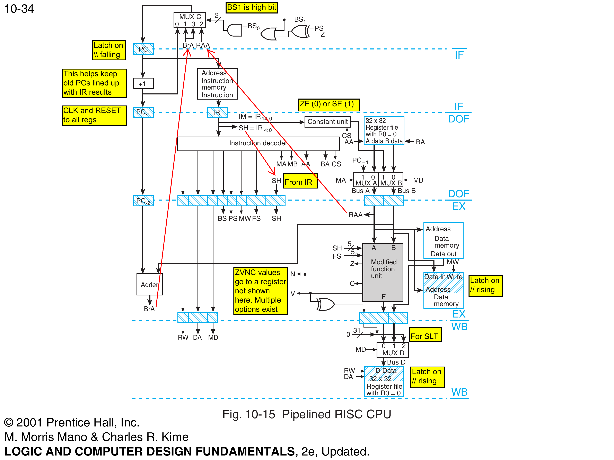
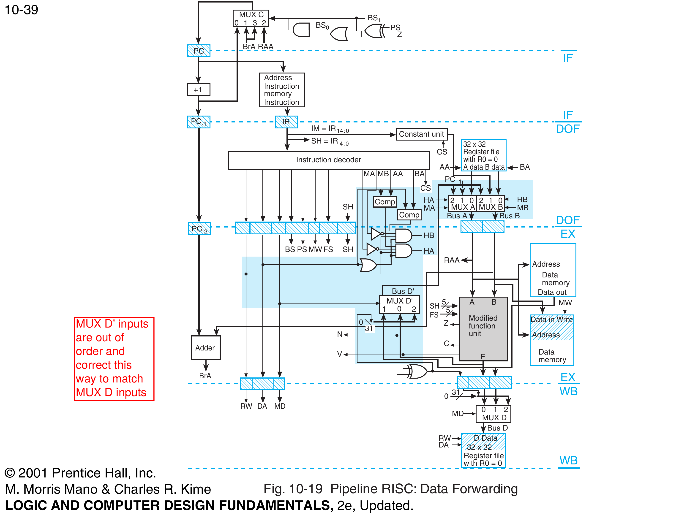
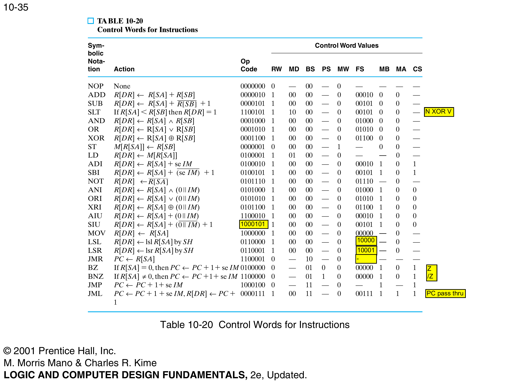

# 32-Bit Pipelined RISC Processor

A 4-stage pipelined RISC CPU based on the datapath described in Mano and Kime's *Logic and Computer Design Fundamentals* (Chapter 10, Figures 10-15 and 10-19). Originally written in Verilog for a university course, currently being refactored with data forwarding, cleaned architecture, and preparation for SystemVerilog conversion and FPGA synthesis.

## Architecture

The processor implements a 4-stage pipeline: IF (Instruction Fetch), DOF (Decode and Operand Fetch), EX (Execute), and WB (Write Back). A branch/PC-select stage (MUXC) runs in parallel with IF.

### Base Pipeline (Fig. 10-15)



*Figure 10-15 from Mano/Kime. The shaded horizontal bars are pipeline registers clocked on the falling edge. Everything between the bars is combinational logic. The register file sits in DOF with write-back from WB. MUXC selects the next PC based on branch conditions from EX.*

### Data Forwarding (Fig. 10-19)



*Figure 10-19 from Mano/Kime. The key additions over Fig. 10-15 are: MUX A and MUX B widened from 2-input to 3-input (with forwarded Bus D' as the third source), two comparator blocks ("Comp") that detect address matches between DOF source registers and the EX destination register, and MUX D' which selects the forwarded result from the EX/WB boundary. HA and HB are the hazard signals that steer the muxes to select forwarded data over register file data.*

### Control Word Encoding (Table 10-20)



*Table 10-20 from Mano/Kime. Each row defines the control word generated by the instruction decoder for one opcode. The FS column feeds the ALU function select, MD selects the write-back source (ALU result, memory, or status), BS/PS control branching, and MA/MB select the operand sources.*

## ISA Summary

The processor implements a 25-instruction ISA with 7-bit opcodes. Instructions are 32 bits wide with three formats: register-register (opcode + DA + SA + SB + unused), register-immediate (opcode + DA + SA + 15-bit immediate), and branch/jump (opcode + DA + SA + 15-bit offset/target).

### Instruction Set

| Category | Instructions | Description |
|----------|-------------|-------------|
| Arithmetic | ADD, SUB, ADI, SBI, AIU, SIU | Register and immediate add/subtract (signed and unsigned) |
| Logic | AND, OR, XOR, NOT, ANI, ORI, XRI | Bitwise operations, register and immediate |
| Shift | LSL, LSR | Logical shift left/right by SH amount |
| Data Transfer | MOV, LD, ST | Register move, memory load/store |
| Compare | SLT | Set less than (writes 1 or 0 to destination) |
| Branch | BZ, BNZ | Branch on zero / not zero (PC-relative, signed offset) |
| Jump | JMP, JMR, JML | Unconditional jump (immediate, register, jump-and-link) |
| No-op | NOP | No operation |

### Status Flags

The ALU produces four flags: Z (zero), C (carry), N (negative), V (overflow). Only Z and VxorN (V XOR N, used by SLT) are forwarded through the pipeline. Flag behavior per instruction type:

| Instruction Type | Z | N | C | V |
|-----------------|---|---|---|---|
| Arithmetic (ADD, SUB, etc.) | Updated | Updated | Updated | Updated |
| Logic (AND, OR, XOR, NOT) | Updated | Updated | Cleared | Cleared |
| Shift (LSL, LSR) | Updated | Updated | Cleared | Cleared |
| MOV | Updated | Preserved | Cleared | Cleared |
| JML | Preserved | Preserved | Cleared | Cleared |

Z preservation during JML and N preservation during MOV/JML are intentional design choices: JML writes a return address (PC+1) to the register file, and updating flags based on an address value would be misleading. MOV is a pass-through where the sign flag from the previous arithmetic operation remains relevant for downstream branches.

## Data Forwarding

The original homework submissions used NOP padding between every instruction to avoid data hazards. The current version implements data forwarding per Figure 10-19 in the textbook.

### How It Works

When the DOF stage decodes an instruction that reads a register, it checks whether the EX stage is about to write that same register. If so, the correct value is forwarded directly to the DOF mux via Bus D' instead of reading the stale value from the register file.

The hazard detection equations (from the textbook, page 555):

```
HA = (!MA) & (AA == DA_EX) & RW_EX & (|DA_EX)
HB = (!MB) & (BA == DA_EX) & RW_EX & (|DA_EX)
```

Four conditions must all be true for forwarding to activate:
1. The operand bus is reading from the register file (MA=0 for Bus A, MB=0 for Bus B), not from PC+1 or an immediate
2. The source register address in DOF matches the destination register address in EX
3. The EX instruction is writing to a register (RW=1)
4. The destination register is not R0 (OR-reduce of DA is 1), since R0 is hardwired to zero

### MUX D' (Forwarding Value Select)

MUX D' sits at the EX/WB boundary and selects the correct value to forward based on `md_ex`. This ensures forwarding works correctly regardless of whether the producing instruction is an ALU operation, a load, or a status write:

| md_ex | Source | Instruction Type |
|-------|--------|-----------------|
| 00 | f_ex (ALU result) | Arithmetic, logic, shift, MOV |
| 01 | data_out_ex (memory read) | LD |
| 10 | {31'd0, vxorn_ex} (status) | SLT |
| 11 | {31'd0, vxorn_ex} (status) | (reserved, same as 10) |

Without MUX D', forwarding would only work for ALU instructions. MUX D' ensures the forwarded value on Bus D' is always the value that will ultimately be written to the destination register.

### MUX A / MUX B Select Encoding

Both operand muxes are 4-input parameterized muxes with a 2-bit select `{H, M}`:

| sel | H | M | Source | When |
|-----|---|---|--------|------|
| 00 | 0 | 0 | Register file | Normal operation, no hazard |
| 01 | 0 | 1 | PC+1 (MUX A) / Constant (MUX B) | Jump-and-link / Immediate instruction |
| 10 | 1 | 0 | Forwarded Bus D' | Hazard detected, forwarding from EX |
| 11 | 1 | 1 | Forwarded Bus D' | Hazard + alternate source (forward takes priority) |

### WB-Stage Forwarding (Two-Cycle Gap)

The textbook design (Fig. 10-19) only implements EX-stage forwarding (one-cycle gap: producer in EX, consumer in DOF). For the two-cycle gap (producer in WB, consumer in DOF), the register file's write-then-read behavior within the same clock cycle resolves the hazard naturally. The WB write completes before the DOF read on the same edge. No additional forwarding hardware is needed for this design.

### Current Data Forwarding Status

EX-stage forwarding is fully implemented and verified via Verilator simulation. The hazard detection signals (HA, HB) correctly fire when consecutive instructions have RAW dependencies, and Bus D' delivers the correct forwarded value through MUX A/B to the consuming instruction.

## Control Hazards (Branch Delay)

### The Problem

Branches (BZ, BNZ) are not resolved until the EX stage, 2 cycles after the branch enters the pipeline. By the time the branch condition is evaluated and the PC is redirected, the two instructions immediately following the branch have already entered IF and DOF and will execute regardless of whether the branch is taken.

In the original NOP-padded code, this was harmless because the two slots after every branch were NOPs. When data forwarding allowed removing NOP gaps between data-dependent instructions, the branch delay slots were inadvertently removed as well. This was discovered during the first Verilator simulation: the multiply program's sign-check branches (BZ at M[11] and M[15]) fell through into SUB/MOV instructions that negated the positive inputs, producing R1=-3 and R2=-7 instead of R1=3 and R2=7.

### The Fix

The instruction memory includes 2 NOPs after each BZ/BNZ instruction to fill the branch delay slots. Straight-line instructions (arithmetic, logic, shift, MOV) remain packed tight with no NOP gaps since data forwarding handles their RAW dependencies. Only branch and jump instructions require delay slot padding.

This is a fundamental limitation of the textbook's pipeline architecture: branches resolve in EX (stage 3), so there is always a 2-cycle penalty. The textbook discusses branch prediction as a hardware solution (Figure 10-22, page 560) but that is beyond the current implementation scope.

## Signal Naming Convention

All signals in the top module follow the pattern `signal_stage` to indicate which pipeline stage the signal belongs to:

| Suffix | Meaning | Example |
|--------|---------|---------|
| `_if` | Produced by or latched for IF stage | `pc_if`, `pc1_if`, `ir_if` |
| `_dof` | Produced by or latched for DOF stage | `ir_dof`, `rw_dof`, `aa_dof`, `bus_a_dof` |
| `_ex` | Produced by or latched for EX stage | `da_ex`, `rw_ex`, `f_ex`, `z_ex` |
| `_wb` | Produced by or latched for WB stage | `da_wb`, `rw_wb`, `f_wb`, `bus_d_wb` |
| `_rf` | From register file | `a_data_rf`, `b_data_rf` |
| `_next` | Combinational next-state | `pc_next` |
| `_fwd` | Forwarded data | `f_fwd` |

Wire signals (combinational outputs) use the stage suffix of the stage that produces them. Register signals use the stage suffix of the stage that consumes them after the clock edge.

## Reading the Waveform

A GTKWave signal list (`pipeline_signals.gtkw`) is included for use with VCD waveform dumps from the Verilator testbench. To generate and view a waveform:

```bash
verilator --binary --trace --timing -Iinclude \
  -Wno-WIDTHEXPAND -Wno-WIDTHTRUNC -Wno-INITIALDLY -Wno-WIDTHCONCAT \
  -Wno-ALWCOMBORDER -Wno-CASEINCOMPLETE -Wno-MULTIDRIVEN -Wno-UNOPTFLAT \
  --top-module RISC_CPU_PIPELINE_tb \
  rtl/*.sv tb/RISC_CPU_PIPELINE_tb.v
./obj_dir/VRISC_CPU_PIPELINE_tb
gtkwave waveform.vcd pipeline_signals.gtkw &
```

### Key Signals by Pipeline Stage

**Clock and Reset:** `clk`, `rst`. 10ns clock period (100 MHz), synchronous reset.

**IF Stage:** `pc_if` (current PC), `pc1_if` (PC+1, fetch address), `ir_if` (fetched instruction).

**DOF Stage, Decode:** `ir_dof` (instruction being decoded), `aa`/`ba` (source register addresses), `da_dof` (destination address), `ma`/`mb` (operand source select), `fs_dof` (ALU function select), `cs` (constant sign extend).

**DOF Stage, Hazard Detection:** `ha`/`hb` (hazard signals, 1 means forwarding is active for Bus A / Bus B).

**DOF Stage, Operands:** `a_data_rf`/`b_data_rf` (register file outputs), `const_data` (sign-extended immediate), `f_fwd` (forwarded value from Bus D'), `bus_a_dof`/`bus_b_dof` (final operand values after mux selection).

**EX Stage:** `da_ex`/`rw_ex` (destination address and write enable, used by DOF hazard detection), `f_ex` (ALU result), `z_ex` (zero flag), `bus_d_prime` (MUX D' output, the forwarded value), `bra_ex` (branch target address), `bs_ex`/`ps_ex` (branch control).

**WB Stage:** `da_wb`/`rw_wb` (write-back destination), `bus_d_wb` (value being written to register file).

**PC Select:** `pc_next` (next PC value from MUX C, shows whether branch was taken).

### How to Trace an Instruction

Pick one instruction and follow it through the stages by watching successive negedge clock edges:

1. It appears in `ir_if` (fetched from instruction memory)
2. Next negedge: moves to `ir_dof`, and `aa`/`ba` show which registers it reads. Check `ha`/`hb` to see if forwarding fires.
3. Next negedge: its control signals appear in the `_ex` signals. `f_ex` shows the ALU result. For branches, `bra_ex` shows the computed target and `pc_next` shows whether the branch was taken.
4. Next negedge: `da_wb`/`rw_wb` show the write-back, and `bus_d_wb` shows the value being written to the register file.

The signals in the `.gtkw` file are ordered top-to-bottom following this flow, so a given instruction's data visually "slides down" the signal list over successive clock edges.

## Module Hierarchy

```
RISC_CPU_PIPELINE (top)
  |-- Register_file       32x32 register file, dual read, single write, R0=0
  |-- IF_SECT             Instruction fetch stage
  |     |-- Instruction_Mem   1025x32 instruction memory
  |-- DOF_SECT            Decode and operand fetch stage (with forwarding)
  |     |-- Instruction_Dec   Control word decoder (Table 10-20)
  |     |-- Constant_unit     Sign/zero extend 15-bit immediate
  |     |-- MUX (MA0)         4:1 parameterized mux for Bus A
  |     |-- MUX (MB0)         4:1 parameterized mux for Bus B
  |-- EX_SECT             Execute stage
  |     |-- ALU               32-bit ALU (10 operations + flags)
  |     |-- Adder             Branch address adder (B + PC_2)
  |     |-- Data_mem          256x32 data memory
  |-- MUXC_SECT           Branch/PC select logic
  |     |-- MUX_C             4:1 PC source mux
  |-- WB_SECT             Write-back stage
        |-- MUX (MD0)          3:1 parameterized mux for write-back data
```

## File Structure

```
hw5_risc/
  rtl/
    RISC_CPU_PIPELINE.sv  Top module with pipeline registers
    IF_SECT.sv            Instruction fetch stage
    DOF_SECT.sv           Decode/operand fetch with forwarding
    EX_SECT.sv            Execute stage (ALU + memory + adder)
    WB_SECT.sv            Write-back stage
    MUXC_SECT.sv          Branch/PC select wrapper
    ALU.sv                32-bit ALU with per-opcode flag handling
    Adder.sv              Branch address adder
    Constant_unit.sv      Immediate sign/zero extension
    Data_mem.sv           256x32 data memory
    Instruction_Dec.sv    Control word decoder
    Instruction_Mem.sv    1025x32 instruction memory (multiply program)
    Register_file.sv      32x32 register file
    MUX.sv                Parameterized N-input mux (used in DOF, WB, and top module)
    MUX_C.sv              4:1 PC source mux (non-standard select mapping)
  tb/
    RISC_CPU_PIPELINE_tb.v   Self-checking top-level testbench (Verilator)
    Register_file_TB.v       Register file testbench
    MUX_C_tb.v               MUX C testbench
  include/
    OPCODES.INC           7-bit opcode definitions
    FSCODES.INC           5-bit ALU function select codes
    REGISTERS.INC         5-bit register address definitions
  docs/
    figures/
      fig10_15_pipeline_base.png       Base pipeline architecture
      fig10_19_data_forwarding.png     Pipeline with data forwarding
      table10_20_control_words.png     ISA control word encoding
  pipeline_signals.gtkw     GTKWave signal list for waveform viewing
```

## Test Program

The instruction memory contains a 32-bit signed multiply program that computes 3 x 7 = 21 using shift-and-add. The result is stored across R20 (high 32 bits) and R21 (low 32 bits). The program handles sign detection, magnitude extraction, shift-and-add multiplication loop, and sign correction of the result. Straight-line instructions are packed consecutively with data forwarding handling RAW dependencies. Branch instructions (BZ/BNZ) are followed by 2 NOP delay slots to account for the 2-cycle branch resolution delay. The program spans M[0]-M[50] with branch offsets calculated using `offset = TargetAddr - BranchAddr - 1`.

**Verification status:** PASS. R20=0x00000000, R21=0x00000015 (21 decimal). Verified in Verilator simulation with self-checking testbench.

## Changes Completed (Phase 1 and Phase 2 in progress)

| ID | Change | Status |
|----|--------|--------|
| CR-01 | Deleted duplicate TOP_SECT.v (was identical to MUXC_SECT.v) | Done |
| CR-02 | Fixed Constant_unit CONST_DATA port direction (input to output) | Done |
| CR-03 | Deleted dead MUX_A.v and MUX_B.v (replaced by parameterized MUX) | Done |
| CR-04 | Removed dead reg C in Adder.v, converted to always_comb | Done |
| CR-05 | Fixed testbench clk/rst initialization (was undefined for first 100ns) | Done |
| CR-06 | Removed shadowed variable names in Instruction_Mem.v | Done |
| CR-07 | ALU flag fix: V=0/C=0 defaults, removed initial block, documented Z/N preservation | Done |
| CR-08 | Internalized unconnected C, N, V ports in EX_SECT | Done |
| CR-09a | Data forwarding: parameterized mux, hazard detection, MUX D', EX forwarding path | Done |
| CR-09b | Instruction memory repack: removed NOP gaps, recalculated branch offsets | Done |
| CR-09c | Self-checking testbench: R20/R21 verification, VCD dump, debug register dump on failure | Done |
| CR-09d | Synchronous reset: merged separate always@(posedge rst) blocks into clocked blocks | Done |
| CR-09e | Control hazard fix: add branch delay NOPs, recalculate offsets, verify R20=0 R21=21 | Done |
| CR-09f | Verible lint fixes: unpacked dimension ordering, default case, MULTIDRIVEN fix | Done |
| CR-09g | Replaced MUX_D.v with parameterized MUX in WB_SECT, deleted MUX_D.v | Done |
| CR-10 | always_ff conversion: negedge pipeline/data_mem, posedge register file, edges preserved | Done |
| CR-11 | SV cleanup: logic types, default_nettype none, dead code removal, .v to .sv rename | Done |

## Remaining Work

### Phase 2: SystemVerilog Conversion (continued)
- CR-12: Add self-checking module-level testbenches with golden reference models
- CR-13: Add branch instruction test program covering BZ, BNZ, JMP, JMR, JML

### Phase 3: FPGA Synthesis (Tang Primer 25K)

The Tang Primer 25K (Gowin GW5A, 23K LUT4, 1008Kb BSRAM) is in hand. This repo will be forked into a synthesis branch for the following work:

- Standardize clock edges to posedge clk (requires WB forwarding or register file clock inversion)
- Reduce instruction memory to fit BSRAM (256x32 or 512x32)
- Convert instruction memory initialization to $readmemh() for program loading without re-synthesis
- Add PLL for clock generation from 27MHz oscillator
- Add reset synchronizer for external button input
- Map status flags and register values to PMOD LEDs
- Add UART TX for program output

### Phase 4: Branch Prediction (separate fork)

This repo will also be forked into a branch prediction development branch targeting three levels of increasing complexity:

**Level 1: Predict-not-taken with squash.** The pipeline fetches sequentially after a branch, assuming the branch will not be taken. When EX determines the branch is taken, a squash signal cancels the two in-flight instructions by zeroing their pipeline register control fields (RW=0, MW=0, BS=0). The PC redirects to the branch target. This eliminates NOP delay slots entirely for not-taken branches (zero penalty) while taken branches still cost 2 cycles. Hardware cost: one squash signal from MUXC back to the pipeline register block, plus mux logic on the pipeline register inputs.

**Level 2: Static prediction (backward-taken, forward-not-taken).** Extends Level 1 by examining the branch offset sign during DOF. Backward branches (negative offset, typically loop back-edges) are predicted taken, and the pipeline begins fetching from the branch target immediately. Forward branches are predicted not taken. This improves prediction accuracy for loops from ~50% to ~90%+. Requires moving the branch target adder from EX to DOF so the target address is available one cycle earlier.

**Level 3: Dynamic prediction (BTB + BHT).** A Branch Target Buffer (64-256 entries, indexed by PC) stores the target address of recently seen branches. A Branch History Table (2-bit saturating counters) tracks taken/not-taken history per branch. The BTB/BHT is looked up in parallel with IF, providing a prediction and target address in the same cycle as the fetch. Mispredictions still incur the 2-cycle squash penalty, but for well-behaved loops, prediction accuracy approaches 95%+. Hardware cost: SRAM-based BTB and BHT tables, lookup logic in IF, update logic from EX.

The branch prediction work builds toward the GPU stretch goal (Section 2.6 of the Engineering Portfolio Deep Dive) by demonstrating increasingly sophisticated pipeline control logic, which directly applies to managing execution pipelines in programmable processing elements.

## Design Notes

### Clock Edge Convention

The pipeline registers and data memory latch on negedge clk. The register file writes on posedge clk. This split-edge timing is inherited from the textbook design (Mano/Kime Fig. 10-15) and is functionally significant: the posedge register file write completes before the negedge pipeline latch, which allows a two-cycle-gap RAW dependency to resolve through the register file's write-then-read behavior without requiring WB-stage forwarding hardware.

Moving to a unified posedge clock (standard for FPGA synthesis) would require adding WB forwarding to handle the two-cycle gap, since a simultaneous posedge write and posedge read with non-blocking assignments returns the old value. This change is deferred to Phase 3 when FPGA synthesis constraints can validate the timing.

### Verilator/Verible Lint Waivers

The register file and data memory reset loops use blocking assignments (`=`) inside `always_ff` blocks. This is required by Verilator (BLKLOOPINIT error on `<=` inside for-loops for arrays) but flagged by Verible (always-ff-non-blocking style rule). The blocking assignment in a synchronous reset context is functionally correct and is the standard workaround for this tool conflict.

## References

- Mano, M.M. and Kime, C.R., *Logic and Computer Design Fundamentals*, 2e, Chapter 10
- Figure 10-15: Pipelined RISC CPU (base architecture)
- Figure 10-19: Pipeline RISC: Data Forwarding
- Table 10-20: Control Words for Instructions

## Author

Bradley Ward
- Original Verilog (2020) with Gerald Barnett, Cody Cartier-Solomon, and Rice Rodriguez
- Pipeline refactoring, data forwarding, and verification (2025-2026)
